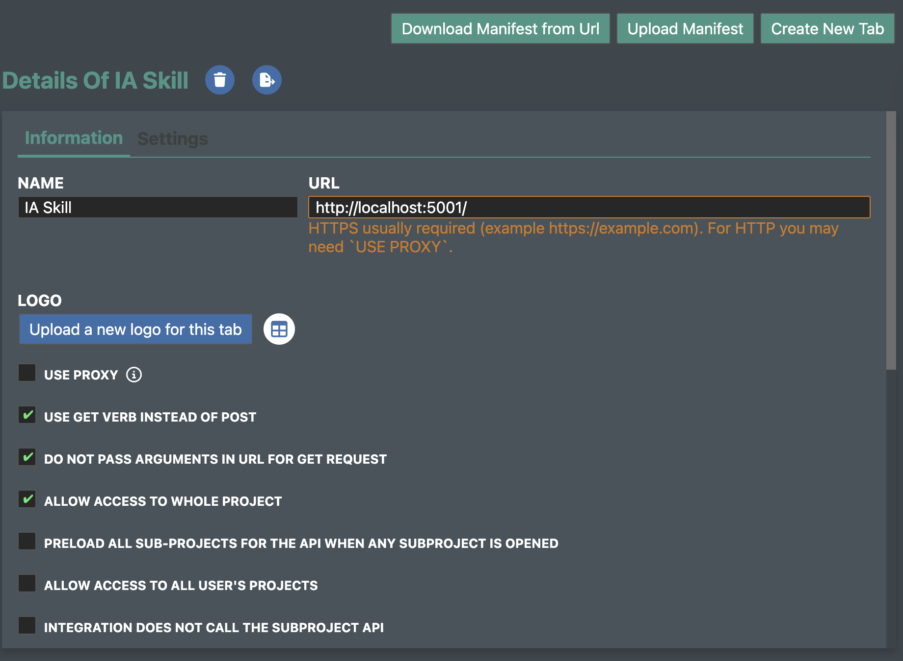

# FieldTwin AI Skill

Teach any AI assistant to help you build FieldTwin integrations — in minutes.

This skill gives your AI assistant complete knowledge of the FieldTwin integration API (v1.10): how to communicate with the platform, how to create and manage resources, how to handle user interactions, and more.

---

## Before You Start — How FieldTwin Integrations Work

Read this section first. It will save you a lot of confusion.

### What is a FieldTwin integration?

A FieldTwin integration is a small web page that appears as a panel inside FieldTwin. FieldTwin loads it inside an **iFrame** — think of it as a browser tab embedded directly in the platform. Your integration can read data from FieldTwin, react to user actions, and send commands back (select assets, zoom the camera, show notifications, etc.).

### There are two kinds of integrations

**Type 1 — Frontend only**

Your entire integration is a single HTML file with JavaScript. It talks directly to the FieldTwin API from the browser.

```
FieldTwin  →  loads your HTML/JS page  →  page calls FieldTwin API
```

Good for: dashboards, asset lists, selection panels, search tools, simple forms.
No server required. Can be hosted for free on GitHub Pages.

---

**Type 2 — Frontend + Backend**

Your HTML/JS page is a thin interface. The real logic runs on a server you control — Python, Node.js, or any language. The page calls your server, your server does the work, and sends results back.

```
FieldTwin  →  loads your HTML/JS page  →  page calls YOUR server  →  server calls FieldTwin API or runs calculations
```

Good for: complex calculations, machine learning, data from external databases, heavy processing (e.g. Python packages for pipeline routing calculations).
Requires a running server (locally during development, deployed for production).

---

### The URL problem — and how to solve it

FieldTwin needs a **public HTTPS URL** to load your integration. This means `http://localhost` does not work out of the box, because FieldTwin runs over HTTPS and browsers block HTTPS pages from loading HTTP content by default.

There are two practical solutions:

---

#### Solution A — GitHub Pages (recommended for Type 1 integrations)

Push your HTML file to GitHub and enable GitHub Pages. Your integration gets a permanent HTTPS URL instantly — no server, no configuration, works from any network including restricted corporate environments.

```
Your HTML file on GitHub  →  GitHub Pages serves it at https://your-org.github.io/your-repo/...
```

This is the recommended path for **simple integrations and vibe coding**. The Hello World in this repository works this way.

---

#### Solution B — localhost with Chrome override (recommended for active development)

For development — especially when you have a backend server running locally — you can tell Chrome to allow your specific FieldTwin instance to load content from `http://localhost`. This is a one-time setting per FieldTwin URL.

**How to enable it:**

1. Open FieldTwin in Chrome.
2. Click the **icon to the left of the URL bar** (the one that shows lock or info).
3. Click **Site settings**.
4. Find **Insecure content**.
5. Change it from **Block** to **Allow**.
6. Reload the page.

That's it. Chrome will now allow your FieldTwin session to load iFrames from `http://localhost`. This setting is saved for that FieldTwin URL.

> This works for both Type 1 and Type 2 integrations. Your backend (Python, Node.js, etc.) can also run on localhost and be called by your iFrame — no tunneling tools required.

---

#### Which solution should I use?

| Situation | Solution |
|---|---|
| I just want to test the Hello World | GitHub Pages — use the link in this repo |
| I am building a simple HTML/JS integration | GitHub Pages — push and share |
| I am developing locally and need live reload | localhost + Chrome override |
| I have a Python/Node backend running locally | localhost + Chrome override |
| I am in a restricted corporate network (e.g. Petrobras) | GitHub Pages for the iFrame; your backend needs to be accessible from your machine |
| I am deploying to production | GitHub Pages (frontend) + your cloud provider (backend) |

---

## What You Can Ask Your AI After Setting This Up

Once the skill is active, your AI assistant can:

- **Generate a complete integration from scratch** — just describe what you want to build
- **Run a Hello World** — verify your connection with one file and a built-in troubleshooter
- **Handle user selections** — react when the user clicks on an asset in the 3D view
- **Add global search** — integrate your data into the FieldTwin search bar
- **Create and manage resources** — add, update, or delete assets, wells, pipelines, shapes, overlays, frames, annotations
- **Show notifications** — send toast messages to FieldTwin
- **Control the camera** — zoom to specific assets or coordinates
- **Add visual filters** — place toggle buttons next to the FieldTwin search bar
- **Display 3D labels** — show status badges next to assets based on their tags
- **Call the FieldTwin REST API** — fetch, create, update, and delete any resource
- **Work with metadata** — read and write custom fields on any resource
- **Debug connection problems** — follow a guided troubleshooting checklist with live diagnostics

---

## Quick Start (5 minutes)

### Step 1 — Pick your platform and add the skill

| Category | Platform                                                                                                                                                                                                                   |
|---|----------------------------------------------------------------------------------------------------------------------------------------------------------------------------------------------------------------------------|
| **IDE Extensions** | [Cursor](#cursor--windsurf) · [Windsurf](#cursor--windsurf) · [GitHub Copilot](#github-copilot) · [Cline](#cline-vs-code) · [Continue.dev](#continuedev) · [JetBrains AI](#jetbrains-ai-assistant)                         |
| **CLI Tools** | [Claude Code](#claude-code) · [Gemini CLI](#gemini-cli) · [Aider](#aider)                                                                                                                                                   |
| **Web — Anthropic** | [Claude.ai Projects](#claudeai-projects)                                                                                                                                                                                   |
| **Web — OpenAI** | [ChatGPT Custom GPT](#chatgpt-custom-gpt) · [ChatGPT Projects](#chatgpt-projects)                                                                                                                                          |
| **Web — Google** | [Gemini Gems](#gemini-gems) · [Google AI Studio](#google-ai-studio)                                                                                                                                                        |
| **Web — Other** | [Mistral Le Chat](#mistral-le-chat) · [Amazon Q Developer](#amazon-q-developer)                                                                                                                                            |
| **Local Models** | [Ollama + Open WebUI](#ollama--open-webui) · [LM Studio](#lm-studio) · [Jan.ai](#janai) · [AnythingLLM](#anythingllm) · [Aider + local](#aider-with-local-models) · [Continue.dev + local](#continuedev-with-local-models) |
| **Direct API access** | [MCP Server](#mcp-server-advanced) — works with Claude Code, Cursor, LM Studio, Gemini CLI, Cline, Continue.dev |

### Step 2 — Run the Hello World

Open `examples/hello-world/index.html` in FieldTwin as an integration. You'll see a "Connected!" screen and a toast notification. Use the **API Test** tab to verify REST API access, and the **Troubleshoot** tab if anything isn't working.

### Step 3 — Start building

Ask your AI assistant:
> "I want to build a FieldTwin integration that shows a list of all assets in the current subproject."

---

## Which File Should I Use?

| File | Size | Best for |
|---|---|---|
| `fieldtwin-instructions.md` | ~19 KB | Models with large context windows (Claude, GPT-4o, Gemini 1.5+) |
| `platforms/copilot-instructions.md` | ~6 KB | GitHub Copilot, Cline, JetBrains AI, most local models |
| `api-quick-reference.md` | ~4 KB | Token-limited models, quick paste in any chat, small local models |
| `api-reference.json` | ~18 KB | Structured endpoint reference — attach as a file when the AI supports it |

> **Raw file URLs** (replace `YOUR_ORG/YOUR_REPO` with your GitHub repository):
> ```
> https://raw.githubusercontent.com/YOUR_ORG/YOUR_REPO/main/fieldtwin-instructions.md
> https://raw.githubusercontent.com/YOUR_ORG/YOUR_REPO/main/api-quick-reference.md
> https://raw.githubusercontent.com/YOUR_ORG/YOUR_REPO/main/platforms/copilot-instructions.md
> ```

---

## Platform Setup

---

### Claude Code

**Best file:** `fieldtwin-instructions.md` + `api-reference.json`

1. Clone or download this repository.
2. Copy the skill file to your integration project:
   ```bash
   mkdir -p .claude/skills
   cp /path/to/fieldtwin-ai-skill/platforms/claude-code-skill.md .claude/skills/fieldtwin.md
   ```
3. Copy the full reference for inline access:
   ```bash
   cp /path/to/fieldtwin-ai-skill/fieldtwin-instructions.md .claude/
   cp /path/to/fieldtwin-ai-skill/api-reference.json .claude/
   ```
4. In Claude Code, type `/fieldtwin` to activate the skill in any conversation.

> The skill file registers `/fieldtwin` as a slash command. Once activated, Claude Code will use `fieldtwin-instructions.md` and `api-reference.json` as its reference for the entire conversation.

---

### GitHub Copilot

**Best file:** `platforms/copilot-instructions.md`

GitHub Copilot automatically reads `.github/copilot-instructions.md` from the root of any repository.

1. In your integration project, create the file:
   ```bash
   mkdir -p .github
   curl -o .github/copilot-instructions.md \
     https://raw.githubusercontent.com/YOUR_ORG/YOUR_REPO/main/platforms/copilot-instructions.md
   ```
2. Commit and push:
   ```bash
   git add .github/copilot-instructions.md
   git commit -m "Add FieldTwin AI skill for GitHub Copilot"
   git push
   ```
3. The skill is now active for **everyone** working on that repository — no per-user setup needed.

> For the VS Code Copilot Chat panel, you can also open the command palette → **GitHub Copilot: Edit Settings** and point to the file manually.

---

### Cursor / Windsurf

**Best file:** `platforms/.cursorrules`

Both Cursor and Windsurf automatically read `.cursorrules` from the project root.

1. Copy the rules file to your integration project root:
   ```bash
   curl -o .cursorrules \
     https://raw.githubusercontent.com/YOUR_ORG/YOUR_REPO/main/platforms/.cursorrules
   ```
2. Restart Cursor or Windsurf if it is already open.
3. No other setup needed — open the AI chat and start asking.

> **Windsurf note:** Windsurf also supports `.windsurfrules` in the project root. You can copy the same file under that name as a fallback.

---

### Cline (VS Code)

**Best file:** `fieldtwin-instructions.md`

Cline is a VS Code extension that supports custom system prompts per project via `.clinerules`.

1. Install the [Cline extension](https://marketplace.visualstudio.com/items?itemName=saoudrizwan.claude-dev) in VS Code.
2. Create a `.clinerules` file in your integration project root:
   ```bash
   curl -o .clinerules \
     https://raw.githubusercontent.com/YOUR_ORG/YOUR_REPO/main/fieldtwin-instructions.md
   ```
3. Cline will automatically inject `.clinerules` as a system prompt for every conversation in that workspace.

> **Alternative:** In the Cline panel, click the **⚙ Settings** icon → **Custom Instructions** and paste the contents of `api-quick-reference.md` for a global (non-project) setup.

---

### Continue.dev

**Best file:** `fieldtwin-instructions.md` or `platforms/copilot-instructions.md`

Continue.dev is an open-source AI coding assistant for VS Code and JetBrains. It supports custom system prompts and context documents.

**Option A — System prompt (recommended):**

Edit `.continue/config.json` in your project (or `~/.continue/config.json` globally):

```json
{
  "models": [...],
  "systemMessage": "PASTE THE CONTENTS OF fieldtwin-instructions.md HERE"
}
```

**Option B — Context document:**

Add the raw GitHub URL as a documentation source so Continue.dev can fetch it on demand:

```json
{
  "docs": [
    {
      "title": "FieldTwin Integration API",
      "startUrl": "https://raw.githubusercontent.com/YOUR_ORG/YOUR_REPO/main/fieldtwin-instructions.md",
      "rootUrl": "https://raw.githubusercontent.com/YOUR_ORG/YOUR_REPO/main/"
    }
  ]
}
```

Then type `@FieldTwin` in the Continue.dev chat to include the reference in any message.

---

### JetBrains AI Assistant

**Best file:** `platforms/copilot-instructions.md`

JetBrains AI Assistant (available in IntelliJ IDEA, PyCharm, WebStorm, etc.) supports custom prompts via the IDE settings.

1. Open **Settings → Tools → AI Assistant → Prompt Library**.
2. Click **+** to create a new prompt.
3. Name it `FieldTwin Skill` and paste the contents of `platforms/copilot-instructions.md`.
4. Save the prompt.
5. In the AI chat panel, type `/FieldTwin Skill` at the start of a conversation to activate it.

> **Alternative:** For a per-project setup, some versions of JetBrains AI Assistant read `.jb-ai-instructions.md` from the project root — paste the contents of `platforms/copilot-instructions.md` into that file.

---

### Aider

**Best file:** `fieldtwin-instructions.md`

[Aider](https://aider.chat) is a CLI coding assistant. You can inject instructions via a conventions file or by passing a file directly.

**Option A — CONVENTIONS.md (auto-loaded):**

```bash
curl -o CONVENTIONS.md \
  https://raw.githubusercontent.com/YOUR_ORG/YOUR_REPO/main/fieldtwin-instructions.md
```

Aider reads `CONVENTIONS.md` from the current directory automatically on startup.

**Option B — Pass as a read-only context file:**

```bash
aider --read fieldtwin-instructions.md --read api-reference.json
```

**Option C — System prompt flag:**

```bash
aider --system-prompt "$(curl -s https://raw.githubusercontent.com/YOUR_ORG/YOUR_REPO/main/api-quick-reference.md)"
```

---

### Claude.ai Projects

**Best file:** `fieldtwin-instructions.md`

Claude.ai Projects let you define a persistent system prompt and attach files that stay active across all conversations in that project.

1. Go to [claude.ai](https://claude.ai) and click **Projects → New Project**.
2. Name it `FieldTwin Development`.
3. Under **Project Instructions**, paste the contents of `fieldtwin-instructions.md`.
4. Under **Project Knowledge**, upload `api-reference.json`.
5. Every new conversation in this project will have the skill active automatically.

> **Context window tip:** Claude supports large context windows, so you can paste the full `fieldtwin-instructions.md` without truncating it.

---

### ChatGPT Custom GPT

**Best file:** `fieldtwin-instructions.md`

1. Go to [chat.openai.com](https://chat.openai.com) → **Explore GPTs → Create**.
2. In the **Instructions** field, paste the contents of `fieldtwin-instructions.md`.
3. Under **Knowledge**, upload `api-reference.json` as a reference file.
4. Name it `FieldTwin Assistant` and save.
5. Use this Custom GPT for all FieldTwin development work.

> **No Custom GPT plan?** Start any conversation with:
> ```
> I'm sharing instructions for a FieldTwin integration skill. Please follow them for this conversation:
>
> [paste contents of api-quick-reference.md]
> ```

---

### ChatGPT Projects

**Best file:** `fieldtwin-instructions.md`

ChatGPT Projects (available on Plus/Pro) let you define custom instructions scoped to a project.

1. Go to [chat.openai.com](https://chat.openai.com) → **Projects → New Project**.
2. Click the project name → **Customize** → **Instructions**.
3. Paste the contents of `fieldtwin-instructions.md`.
4. Upload `api-reference.json` as a project file (click the paperclip icon in the project sidebar).
5. All chats in this project will have the skill active.

---

### Gemini CLI

**Best file:** `platforms/gemini-cli.md` (copy to `GEMINI.md`)

The [Gemini CLI](https://github.com/google-gemini/gemini-cli) (`@google/gemini-cli`) is Google's official command-line AI assistant. It reads `GEMINI.md` from the current project directory automatically — the same pattern as Claude Code's `CLAUDE.md`.

1. Install the Gemini CLI:
   ```bash
   npm install -g @google/gemini-cli
   ```
2. Copy the skill file to your integration project:
   ```bash
   curl -o GEMINI.md \
     https://raw.githubusercontent.com/YOUR_ORG/YOUR_REPO/main/platforms/gemini-cli.md
   ```
3. Optionally copy the full reference and endpoint list:
   ```bash
   curl -o fieldtwin-instructions.md \
     https://raw.githubusercontent.com/YOUR_ORG/YOUR_REPO/main/fieldtwin-instructions.md
   curl -o api-reference.json \
     https://raw.githubusercontent.com/YOUR_ORG/YOUR_REPO/main/api-reference.json
   ```
4. Run `gemini` in your project folder — the skill is active automatically.

> `GEMINI.md` is loaded as context for every session in that directory. You can commit it to your repository so the whole team gets the skill automatically.

---

### Gemini Gems

**Best file:** `platforms/copilot-instructions.md`

1. Go to [gemini.google.com](https://gemini.google.com) → **Gems → New Gem**.
2. Name it `FieldTwin Assistant`.
3. In the **Instructions** field, paste the contents of `platforms/copilot-instructions.md`.
4. Save the Gem and use it for FieldTwin development.

> **Context limit note:** Gemini Gems have a system prompt character limit. If the instructions are truncated, use `api-quick-reference.md` instead, which is more compact.

---

### Google AI Studio

**Best file:** `fieldtwin-instructions.md`

Google AI Studio lets you create prompts with a persistent system instruction and test them with any Gemini model.

1. Go to [aistudio.google.com](https://aistudio.google.com) → **Create new prompt**.
2. In the **System instructions** field, paste the contents of `fieldtwin-instructions.md`.
3. Upload `api-reference.json` as a file attachment (click the paperclip icon).
4. Save as a **Saved prompt** named `FieldTwin Skill`.
5. Use this prompt as your starting point for all FieldTwin work.

> AI Studio also supports sharing prompts via URL — share yours with your team to give everyone the same starting point.

---

### Mistral Le Chat

**Best file:** `api-quick-reference.md`

[Le Chat](https://chat.mistral.ai) by Mistral supports custom assistants with system prompts.

1. Go to [chat.mistral.ai](https://chat.mistral.ai) → **Assistants → New Assistant**.
2. Name it `FieldTwin Assistant`.
3. In the **System prompt** field, paste the contents of `api-quick-reference.md`.
4. Save and use the assistant for FieldTwin work.

> **Ad-hoc use:** Start any Le Chat conversation by pasting `api-quick-reference.md` as the first message.

---

### Amazon Q Developer

**Best file:** `platforms/copilot-instructions.md`

Amazon Q Developer (available in VS Code, JetBrains, and the AWS console) supports workspace context through a `.amazonq` folder.

1. In your integration project, create the instructions file:
   ```bash
   mkdir -p .amazonq
   curl -o .amazonq/rules.md \
     https://raw.githubusercontent.com/YOUR_ORG/YOUR_REPO/main/platforms/copilot-instructions.md
   ```
2. Amazon Q Developer will include this file as context in inline suggestions and chat responses.
3. In the Q chat panel, you can also type `/dev` followed by your question to use the full context.

---

## Local Models

Running a local model? You can still use this skill — the key is injecting the instructions as a system prompt. All major local model runners support this.

> **Model recommendations for best results:**
> - Code tasks: `deepseek-coder-v2`, `qwen2.5-coder:32b`, `codestral`
> - General: `llama3.1:70b`, `mistral-large`, `gemma3:27b`
> - Low RAM: `qwen2.5-coder:7b`, `llama3.2:3b` with `api-quick-reference.md`

---

### Ollama + Open WebUI

**Best file:** `fieldtwin-instructions.md` or `api-quick-reference.md` depending on the model's context window.

**Open WebUI (recommended UI for Ollama):**

1. Install [Ollama](https://ollama.com) and pull a model:
   ```bash
   ollama pull qwen2.5-coder:32b
   ```
2. Install [Open WebUI](https://openwebui.com):
   ```bash
   docker run -d -p 3000:80 --add-host=host.docker.internal:host-gateway \
     -v open-webui:/app/backend/data ghcr.io/open-webui/open-webui:main
   ```
3. Open `http://localhost:3000` → **Workspace → Modelfiles → New Modelfile**.
4. Create a Modelfile for FieldTwin:
   ```
   FROM qwen2.5-coder:32b
   SYSTEM """
   PASTE THE CONTENTS OF fieldtwin-instructions.md HERE
   """
   ```
5. Save as `fieldtwin-dev` and select it in any chat.

**Ollama CLI (direct):**

```bash
# Create a Modelfile
cat > Modelfile << 'EOF'
FROM qwen2.5-coder:32b
SYSTEM """
$(curl -s https://raw.githubusercontent.com/YOUR_ORG/YOUR_REPO/main/api-quick-reference.md)
"""
EOF

# Build the custom model
ollama create fieldtwin-dev -f Modelfile

# Run it
ollama run fieldtwin-dev
```

**Ollama API (for integrating with other tools):**

```bash
curl http://localhost:11434/api/chat -d '{
  "model": "qwen2.5-coder:32b",
  "messages": [
    {
      "role": "system",
      "content": "PASTE api-quick-reference.md CONTENTS HERE"
    },
    {
      "role": "user",
      "content": "Build me a FieldTwin integration that lists all assets"
    }
  ]
}'
```

---

### LM Studio

**Best file:** `api-quick-reference.md` (for most models) or `fieldtwin-instructions.md` (for models with 32k+ context)

1. Install [LM Studio](https://lmstudio.ai) and download a model (recommended: `Qwen2.5-Coder-32B-Instruct`).
2. In the **Chat** tab, click the **System Prompt** field at the top.
3. Paste the contents of `fieldtwin-instructions.md` (or `api-quick-reference.md` for smaller models).
4. Start chatting — the skill is active for this session.

**For persistent setup:**

1. Go to **My Models → Edit Preset** for your chosen model.
2. In **System Prompt**, paste the instructions.
3. Save the preset. The skill will be loaded every time you use that preset.

**LM Studio local server (OpenAI-compatible API):**

```python
from openai import OpenAI

client = OpenAI(base_url="http://localhost:1234/v1", api_key="lm-studio")

system_prompt = open("api-quick-reference.md").read()

response = client.chat.completions.create(
    model="qwen2.5-coder-32b",
    messages=[
        {"role": "system", "content": system_prompt},
        {"role": "user",   "content": "Build a FieldTwin integration that shows selected assets"}
    ]
)
print(response.choices[0].message.content)
```

---

### Jan.ai

**Best file:** `api-quick-reference.md`

[Jan.ai](https://jan.ai) is an open-source local AI assistant with a ChatGPT-like interface.

1. Install Jan.ai and download a model from the Hub (recommended: `Qwen2.5-Coder-7B-Instruct` or `Codestral-22B`).
2. Go to **Settings → My Models → [your model] → Edit**.
3. In the **System Prompt** field, paste the contents of `api-quick-reference.md`.
4. Save — the skill is now active every time you use that model in Jan.

**Jan API (OpenAI-compatible):**

```bash
curl http://localhost:1337/v1/chat/completions \
  -H "Content-Type: application/json" \
  -d '{
    "model": "qwen2.5-coder-7b-instruct",
    "messages": [
      {"role": "system", "content": "PASTE api-quick-reference.md CONTENTS HERE"},
      {"role": "user",   "content": "How do I listen for asset selection in FieldTwin?"}
    ]
  }'
```

---

### AnythingLLM

**Best file:** `fieldtwin-instructions.md` + `api-reference.json`

[AnythingLLM](https://anythingllm.com) supports workspaces with custom system prompts and document ingestion — ideal for this skill.

1. Install AnythingLLM (Desktop or Docker) and connect it to Ollama, LM Studio, or any OpenAI-compatible backend.
2. Create a **New Workspace** named `FieldTwin`.
3. In **Workspace Settings → Prompt**:
   - Set the **System Prompt** to the contents of `fieldtwin-instructions.md`.
4. In the workspace **Documents** section:
   - Upload `api-reference.json` — AnythingLLM will chunk and embed it for RAG.
   - The AI will be able to look up specific endpoints when needed.
5. Start chatting in the `FieldTwin` workspace.

> **RAG tip:** Uploading `api-reference.json` as a document lets AnythingLLM retrieve specific endpoints even when they don't fit in the active context window.

---

### Aider with Local Models

**Best file:** `fieldtwin-instructions.md` via `CONVENTIONS.md`

Aider works with any OpenAI-compatible API, including Ollama and LM Studio.

```bash
# With Ollama
OLLAMA_API_BASE=http://localhost:11434
aider --model ollama/qwen2.5-coder:32b \
      --read fieldtwin-instructions.md \
      --read api-reference.json

# With LM Studio
aider --openai-api-base http://localhost:1234/v1 \
      --openai-api-key lm-studio \
      --model openai/qwen2.5-coder-32b \
      --read fieldtwin-instructions.md

# With CONVENTIONS.md (auto-loaded, no flag needed)
cp fieldtwin-instructions.md CONVENTIONS.md
aider --model ollama/qwen2.5-coder:32b
```

---

### Continue.dev with Local Models

Continue.dev works with Ollama, LM Studio, and any OpenAI-compatible server.

Edit `~/.continue/config.json`:

```json
{
  "models": [
    {
      "title": "FieldTwin Dev (Ollama)",
      "provider": "ollama",
      "model": "qwen2.5-coder:32b",
      "systemMessage": "PASTE THE CONTENTS OF fieldtwin-instructions.md HERE"
    },
    {
      "title": "FieldTwin Dev (LM Studio)",
      "provider": "openai",
      "apiBase": "http://localhost:1234/v1",
      "apiKey": "lm-studio",
      "model": "qwen2.5-coder-32b",
      "systemMessage": "PASTE THE CONTENTS OF api-quick-reference.md HERE"
    }
  ]
}
```

Restart VS Code after saving. The skill-enabled model will appear in the Continue.dev model picker.

---

## MCP Server (Advanced)

The MCP (Model Context Protocol) server gives any compatible AI client **direct access to your FieldTwin data** — no code generation required. Instead of asking the AI to write API calls for you to run, it can execute them directly and show you live results in the conversation.

MCP is an open protocol. The model (Claude, Gemini, GPT-4o, DeepSeek, Llama, etc.) only needs to support **tool calling** — which all modern LLMs do. What matters is whether your **client application** supports MCP.

### Skill vs MCP Server — which one do I need?

| | Skill | MCP Server |
|---|---|---|
| **What it does** | Teaches the AI how to write FieldTwin integration code | Gives the AI tools to call the FieldTwin API directly |
| **Who runs the code** | You (AI writes it, you run it) | The AI (executes API calls autonomously) |
| **Output** | Working code you can put in your integration | Live data from your FieldTwin account |
| **Best for** | Building new integrations | Querying data, bulk changes, exploring your project |
| **Requires** | Any AI assistant | A MCP-compatible client + Node.js + FieldTwin API Token |
| **Works offline** | Yes (just instructions) | No (makes real API calls) |

**Use the Skill when you want code.** Use the MCP server when you want the AI to query or act on your live FieldTwin data directly.

Both can be active at the same time — they complement each other.

---

### Requirements

- [Node.js](https://nodejs.org) 18 or later
- A MCP-compatible client (see table below)
- A FieldTwin **API Token** (from FieldTwin Settings → API Tokens)

> The API Token is **not** the same as the JWT token from the `loaded` event. It is account-level and stays on your machine — never put it in your integration's HTML/JS code.

### Compatible clients

| Client | Models you can use | MCP support |
|---|---|---|
| **Claude Code** | Claude | Native |
| **Cursor** | GPT-4o, Claude, Gemini, DeepSeek, any | Yes |
| **Windsurf** | GPT-4o, Claude, Gemini, any | Yes |
| **Cline** (VS Code) | Any model via API key | Yes |
| **Continue.dev** | Ollama, LM Studio, any OpenAI-compat. | Yes |
| **Gemini CLI** | Gemini | Yes |
| **LM Studio** | Llama, Qwen, DeepSeek, Gemma, any local | Yes (v0.3.5+) |
| **AnythingLLM** | Any local or cloud model | Yes |

---

**Step 0 — Install dependencies (all clients):**

```bash
cd mcp-server
npm install
```

---

### Setup — Claude Code

Create or edit `.claude/settings.json` in your project directory. For a global setup (available in all projects), use `~/.claude/settings.json` instead.

```json
{
  "mcpServers": {
    "fieldtwin": {
      "command": "node",
      "args": ["/absolute/path/to/fieldtwin-ai-skill/mcp-server/index.js"],
      "env": {
        "FIELDTWIN_BACKEND_URL": "https://backend.fieldtwin.com",
        "FIELDTWIN_API_TOKEN": "your-api-token-here",
        "FIELDTWIN_SUBPROJECT_ID": "optional-default-subproject-id"
      }
    }
  }
}
```

Replace `/absolute/path/to/fieldtwin-ai-skill` with the actual absolute path on your machine. Restart Claude Code after saving.

---

### Setup — Cursor

Cursor reads MCP servers from `~/.cursor/mcp.json` (global, all projects) or `.cursor/mcp.json` (per-project). You can also add them via **Cursor Settings → MCP → Add server**.

```json
{
  "mcpServers": {
    "fieldtwin": {
      "command": "node",
      "args": ["/absolute/path/to/fieldtwin-ai-skill/mcp-server/index.js"],
      "env": {
        "FIELDTWIN_BACKEND_URL": "https://backend.fieldtwin.com",
        "FIELDTWIN_API_TOKEN": "your-api-token-here",
        "FIELDTWIN_SUBPROJECT_ID": "optional-default-subproject-id"
      }
    }
  }
}
```

The JSON format is identical to Claude Code. Once configured, you can use any model in Cursor (GPT-4o, Claude, Gemini, DeepSeek, etc.) — all will have access to the FieldTwin tools.

---

### Setup — LM Studio

LM Studio 0.3.5+ supports MCP natively.

1. Open LM Studio → click the **Developer** tab (or the plug icon in the sidebar).
2. Select **MCP Servers → Add server**.
3. Fill in the fields:
   - **Name:** `fieldtwin`
   - **Command:** `node`
   - **Args:** `/absolute/path/to/fieldtwin-ai-skill/mcp-server/index.js`
   - **Environment variables:**
     - `FIELDTWIN_BACKEND_URL` = `https://backend.fieldtwin.com`
     - `FIELDTWIN_API_TOKEN` = your token
     - `FIELDTWIN_SUBPROJECT_ID` = (optional)
4. Click **Save**. The server starts automatically when you open a chat.

Any local model you load in LM Studio (Llama 3, DeepSeek, Qwen, Gemma, Mistral, etc.) will have access to all 98 FieldTwin tools — as long as the model supports tool calling (most 7B+ models do).

---

### Setup — Gemini CLI

Gemini CLI reads MCP servers from `~/.gemini/settings.json` (global) or `.gemini/settings.json` in the project directory.

```json
{
  "mcpServers": {
    "fieldtwin": {
      "command": "node",
      "args": ["/absolute/path/to/fieldtwin-ai-skill/mcp-server/index.js"],
      "env": {
        "FIELDTWIN_BACKEND_URL": "https://backend.fieldtwin.com",
        "FIELDTWIN_API_TOKEN": "your-api-token-here",
        "FIELDTWIN_SUBPROJECT_ID": "optional-default-subproject-id"
      }
    }
  }
}
```

Restart Gemini CLI after saving. Type `gemini` in your project folder and the `fieldtwin` tools will be available automatically.

---

### Setup — Cline (VS Code)

1. Open VS Code → click the Cline icon in the sidebar.
2. Click **MCP Servers → Configure MCP Servers**.
3. This opens `cline_mcp_settings.json`. Add the `fieldtwin` entry:

```json
{
  "mcpServers": {
    "fieldtwin": {
      "command": "node",
      "args": ["/absolute/path/to/fieldtwin-ai-skill/mcp-server/index.js"],
      "env": {
        "FIELDTWIN_BACKEND_URL": "https://backend.fieldtwin.com",
        "FIELDTWIN_API_TOKEN": "your-api-token-here",
        "FIELDTWIN_SUBPROJECT_ID": "optional-default-subproject-id"
      }
    }
  }
}
```

Save the file. Cline will connect to the server immediately (no restart needed). You can then use any model configured in Cline.

---

### Setup — Continue.dev

Edit `~/.continue/config.json` and add an `mcpServers` block:

```json
{
  "models": [...],
  "mcpServers": [
    {
      "name": "fieldtwin",
      "command": "node",
      "args": ["/absolute/path/to/fieldtwin-ai-skill/mcp-server/index.js"],
      "env": {
        "FIELDTWIN_BACKEND_URL": "https://backend.fieldtwin.com",
        "FIELDTWIN_API_TOKEN": "your-api-token-here",
        "FIELDTWIN_SUBPROJECT_ID": "optional-default-subproject-id"
      }
    }
  ]
}
```

Restart VS Code after saving. Continue.dev will expose the FieldTwin tools to whichever model you have active — including local models via Ollama or LM Studio.

---

### Verify (all clients)

Ask your AI:
> "List all my FieldTwin projects"

The AI will call the MCP server and show you live results from your account.

---

### Available tools (98)

| Category | Tools |
|---|---|
| **Projects** | `list_projects`, `get_project`, `create_project`, `update_project` |
| **SubProjects** | `list_subprojects`, `get_subproject`, `create_subproject`, `update_subproject`, `delete_subproject`, `get_subproject_hierarchy`, `get_subproject_is_ready`, `get_subproject_share_url`, `get_subproject_tags` |
| **Staged Assets** | `get_staged_assets`, `get_staged_asset`, `create_staged_asset`, `create_staged_assets_batch`, `update_staged_asset`, `delete_staged_asset` |
| **Wells** | `get_wells`, `get_well`, `create_well`, `create_wells_batch`, `update_well`, `delete_well` |
| **Well Bores** | `create_well_bore`, `update_well_bore`, `delete_well_bore`, `get_well_bore_segments`, `update_well_bore_segment`, `delete_well_bore_segment` |
| **Connections** | `get_connections`, `get_connection`, `create_connection`, `create_connections_batch`, `update_connection`, `delete_connection` |
| **Connection Segments** | `get_connection_segments`, `create_connection_segment`, `update_connection_segment`, `delete_connection_segment` |
| **Shapes** | `get_shapes`, `get_shape`, `create_shape`, `create_shapes_batch`, `update_shape`, `delete_shape` |
| **Overlays** | `get_overlays`, `get_overlay`, `create_overlay`, `create_overlays_batch`, `update_overlay` _(no delete — not available in API)_ |
| **Annotations** | `get_annotations`, `get_annotation`, `create_annotation`, `update_annotation`, `delete_annotation` |
| **Layers** | `get_layers`, `get_layer`, `create_layer`, `update_layer`, `delete_layer` |
| **Custom Costs** | `get_custom_costs`, `get_custom_cost`, `create_custom_cost`, `create_custom_costs_batch`, `update_custom_cost`, `delete_custom_cost` |
| **Subproject Documents** | `get_subproject_documents`, `upload_subproject_document`, `delete_subproject_document` |
| **Metadata** | `get_metadata_definitions`, `get_account_metadata_definitions`, `get_metadata`, `add_metadata`, `update_metadata`, `delete_metadata` |
| **Type Lookups** | `get_assets`, `get_well_types`, `get_well_bore_types`, `get_annotation_types`, `get_shape_types`, `get_layer_types`, `get_connection_types`, `get_connection_type`, `get_connection_categories`, `get_connection_segment_types`, `get_well_bore_segment_types` |
| **Tags** | `get_tags`, `get_tag`, `create_tag`, `update_tag`, `delete_tag` |
| **Account** | `get_users`, `get_user`, `get_usage`, `get_account_logs`, `get_integrations` |

---

### Example prompts

```
"List all staged assets in subproject abc123"
"How many connections are in my project?"
"Find all assets with status Planned and change them to Installed"
"Create a new well at x=665000, y=400000 named Production Well 1"
"Show me the custom metadata fields defined in this project"
"Delete all staged assets tagged type::temporary"
"What assets are closest to coordinates 665000, 400000?"
```

---

### How the MCP server works internally

The server runs as a local process via **stdio transport** — your MCP client spawns it automatically. There is no web server, no open port, and no network exposure beyond the calls it makes to the FieldTwin API. All credentials stay in your client's config file, which you should keep out of version control.

```
AI Client  ──stdin/stdout──  mcp-server/index.js  ──HTTPS──  FieldTwin API
```

---

## Hello World

The Hello World is a single self-contained HTML file. When opened inside FieldTwin as an integration, it:

- Connects to FieldTwin and displays your session info (SubProject ID, Backend URL, Tab ID, API readiness)
- Sends a success toast notification: "Hello from FieldTwin AI Skill!"
- Logs every event received from FieldTwin in real time
- Shows which items are currently selected in the 3D view

**Built-in tabs:**

| Tab | What it does |
|---|---|
| **Session** | Live session info and real-time event log |
| **API Test** | Makes real REST API calls (Assets, Wells, Connections, Shapes, Metadata) and shows the raw JSON response |
| **Troubleshoot** | Runs 8 automated checks (protocol, iFrame, loaded event, token, backendUrl, subProjectId, API readiness, live API ping) with a specific fix for each failure |

**File:** `examples/hello-world/index.html`

**How to run it:**

Option A — Local server (fastest):
```bash
npx serve examples/hello-world
# Open http://localhost:3000 in FieldTwin as an integration
```

Option B — GitHub Pages:
1. Push this repository to GitHub.
2. Enable GitHub Pages (Settings → Pages → Deploy from `main`).
3. Your Hello World URL: `https://YOUR_ORG.github.io/YOUR_REPO/examples/hello-world/`

Option C — Any web server:
Copy `index.html` to your server. The file is completely self-contained.

**How to add it to FieldTwin:**
1. Go to **Admin → Integrations → Create New Tab**
2. Enter a name for your integration
3. Add the URL (e.g. `http://localhost:5001` or your ngrok URL)
4. Enable the following options:
   - **Use Get Verb Instead of Post**
   - **Do not pass arguments in URL for Get request**
   - **Allow Access to Whole Project**
5. Save and open the integration panel — you should see "Connected to FieldTwin!"



---

## Repository Structure

```
fieldtwin-ai-skill/
│
├── README.md                         ← You are here
├── fieldtwin-instructions.md         ← Full skill reference — large context models
├── api-reference.json                ← All 120+ REST endpoints (v1.10), structured JSON
├── api-quick-reference.md            ← Compact reference — token-limited models
│
├── platforms/
│   ├── claude-code-skill.md          ← Claude Code /fieldtwin skill
│   ├── copilot-instructions.md       ← GitHub Copilot, Cline, JetBrains AI
│   ├── gemini-cli.md                 ← Gemini CLI (copy to GEMINI.md)
│   └── .cursorrules                  ← Cursor / Windsurf
│
├── mcp-server/
│   ├── index.js                      ← MCP server — 24 tools for direct FieldTwin API access
│   ├── package.json                  ← Node.js dependencies (@modelcontextprotocol/sdk, zod)
│   └── .env.example                  ← Environment variable template
│
└── examples/
    └── hello-world/
        └── index.html                ← Test integration: session info, API test, troubleshooter
```

---

## Example Prompts

Once the skill is active, try these with your AI assistant:

**Getting started**
> "Walk me through building my first FieldTwin integration."

**Hello World**
> "Show me the Hello World integration and explain how to run it."

**Selection handling**
> "Build an integration that shows the name and type of whatever the user selects in the 3D view."

**Search integration**
> "Add global search support to my integration. When the user searches, query my REST API and return the results."

**Resource creation**
> "Write code to place a temporary marker at coordinates x=665000, y=400000 when the user clicks a button."

**Visual filters**
> "Add two filter buttons to the FieldTwin search bar: 'Active' and 'Planned'. When toggled, select the matching assets."

**REST API — read**
> "Fetch all staged assets from the current subproject and display them in a list."

**REST API — write**
> "Write code to update the status of a staged asset to 'Installed' using the REST API."

**Metadata**
> "Show me how to read and display custom metadata fields from a selected asset."

**Batch operations**
> "I need to create 50 connections at once. Show me how to use the batch endpoint."

**Troubleshooting**
> "My integration is not receiving the loaded event. Help me debug this."

---

## Contributing

Found something missing or incorrect? Please open an issue or submit a pull request.

For questions about FieldTwin integrations, refer to the [FieldTwin API documentation](https://api.fieldtwin.com).

OpenAPI spec: https://api-qa.fieldtwin.com/oas3.json

---

## License

MIT
