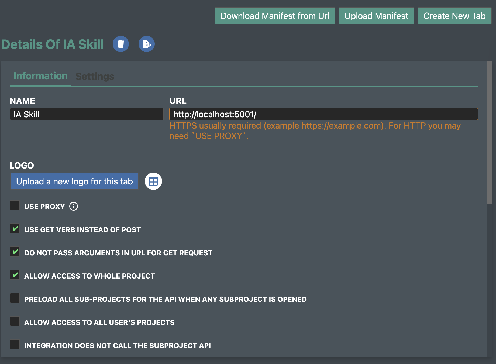

# FieldTwin Agent Skills and AI Toolkit

Teach any AI assistant to build secure FieldTwin integrations.

This repository combines two things:

1. **The FieldTwin Agent Skills** from FutureOn — portable [Agent Skills](https://agentskills.io/home)
   for creating and developing FieldTwin custom-tab integrations. They are documentation only:
   no MCP server, no network requests, and no credentials.
   - `create-fieldtwin-integration` — choose the shape (single page or full repository), start
     from the Hello World, host it, scaffold Docker, Helm, Tilt, and the build pipeline.
   - `develop-fieldtwin-integration` — secure `postMessage` bridge, `loaded`/`tokenRefresh`,
     every host message and API field (searchable catalogs), Operation Mode, pop-outs, and tests.
2. **Toolkit extras** for everything else: single-file guides for AI tools that cannot load
   skills, per-tool instruction files, project scripts, server templates, and an optional,
   separately packaged MCP server.

The skills are merged from the official
[XvisionAS/fieldtwin-agent-skills](https://github.com/XvisionAS/fieldtwin-agent-skills)
repository with its history, so upstream releases can be pulled in (see
[Keeping in sync with upstream](#keeping-in-sync-with-upstream)).

---

## Navigation

| I want to... | Go to |
|---|---|
| Start a new integration in five minutes | [Quick start](#quick-start-5-minutes) |
| Install the skills in an agent that supports them | [Install the Agent Skills](#install-the-agent-skills) |
| Set up an AI tool that does not support skills | [Platform setup](#platform-setup) |
| Understand the security rules the code follows | [Security model](#security-model) |
| Let an AI call my live FieldTwin data | [MCP server (optional)](#mcp-server-optional) |
| Use FieldTwin from VS Code | [VS Code extension](#vs-code-extension) |
| Verify my connection | [Hello World](#hello-world) |
| Contribute or validate a change | [Contributing](#contributing) |

---

## Quick start (5 minutes)

**Starting a new integration?** Run the create script. It asks for a name, a template, your
FieldTwin address, and your AI tools, then sets everything up.

```bash
# Linux / macOS
curl -sSfL https://raw.githubusercontent.com/patricksponte/ft-skill/main/create.sh -o create.sh && bash create.sh
```

```powershell
# Windows (PowerShell)
Invoke-WebRequest -Uri "https://raw.githubusercontent.com/patricksponte/ft-skill/main/create.ps1" -OutFile create.ps1; .\create.ps1
```

Then:

1. **Host the Hello World** over HTTPS (GitHub Pages works) and add it in FieldTwin — see
   [Hello World](#hello-world). You should see **Connected** and a toast.
2. **Ask your AI:** "Build a FieldTwin integration that lists all staged assets in the current
   subproject."

---

## Install the Agent Skills

Agents that support Agent Skills (Claude Code, Codex, Cursor, GitHub Copilot, and others) should
use the skills directly. Install with the cross-agent `skills` CLI:

```bash
npx skills add patricksponte/ft-skill --skill develop-fieldtwin-integration
npx skills add patricksponte/ft-skill --skill create-fieldtwin-integration
```

Add `--global --agent <agent> --yes` for a user-wide, non-interactive install, for example
`--agent claude-code`. GitHub CLI 2.90 or later also works:

```bash
gh skill install patricksponte/ft-skill develop-fieldtwin-integration --agent claude-code --scope user
```

You can also copy `skills/<name>` into any skills directory your agent reads. Update with
`npx skills update develop-fieldtwin-integration` (and the same for the create skill).

Example prompts:

- `Use create-fieldtwin-integration to build a quick single-page FieldTwin integration I can drop on GitHub Pages.`
- `Use develop-fieldtwin-integration to add Operation Mode search with inline focus actions.`
- `Review this FieldTwin postMessage integration for origin, token, and teardown problems.`
- `Build a FieldTwin v1.10 client for subproject resources and batch writes.`

---

## Security model

Every sample in this repository follows these rules, and the CI validator rejects code that does
not:

- The integration accepts `loaded` only from an **exact allowlisted FieldTwin origin** and the
  real host window (`window.parent` in an iframe, `window.opener` in a pop-out), then **pins**
  both.
- It sends only to that pinned window and origin. **`postMessage(..., '*')` is never used.**
- The JWT stays in memory, is replaced on `tokenRefresh`, and never appears in URLs, storage,
  the DOM, or logs.
- API calls use the trusted `backendUrl`, the real `projectId`, and the qualified
  `{subProjectId}:{streamId}` — there is no `project/-` wildcard.
- Account API tokens stay on servers and in the optional MCP server, never in browser code.

The only thing a user configures is their FieldTwin address. The create script asks for it, and
the Hello World shows the origin of any rejected connection so the user can confirm and add it.

---

## Platform setup

**Which file should I use?**

| File | Best for |
|---|---|
| `skills/` (Agent Skills) | Any agent that supports skills: Claude Code, Codex, Cursor, Copilot, and more |
| `fieldtwin-instructions.md` | Tools without skills and with large context windows: Cline, Aider, Claude.ai and ChatGPT projects, Continue |
| `api-quick-reference.md` | Small context windows: local models, Gemini Gems, Le Chat, quick pastes |
| `api-reference.json` | Attachable route list: all 275 v1.10 operations, generated from the skill's catalog |
| `platforms/*` | Ready-made copies of the guides with tool-specific headers (Copilot, Cursor, Antigravity, OpenCode) |

> The files in `platforms/` and `api-reference.json` are generated. Edit
> `fieldtwin-instructions.md` or `api-quick-reference.md` and run the build scripts described in
> [Contributing](#contributing).
>
> **Raw file URLs:**
> ```
> https://raw.githubusercontent.com/patricksponte/ft-skill/main/fieldtwin-instructions.md
> https://raw.githubusercontent.com/patricksponte/ft-skill/main/api-quick-reference.md
> https://raw.githubusercontent.com/patricksponte/ft-skill/main/platforms/copilot-instructions.md
> ```

---

### IDE Extensions


<details>
<summary><strong>GitHub Copilot</strong></summary>

**Best file:** `platforms/copilot-instructions.md`

GitHub Copilot automatically reads `.github/copilot-instructions.md` from the root of any repository.

1. In your integration project, create the file:
   ```bash
   mkdir -p .github
   curl -o .github/copilot-instructions.md \
     https://raw.githubusercontent.com/patricksponte/ft-skill/main/platforms/copilot-instructions.md
   ```
2. Commit and push:
   ```bash
   git add .github/copilot-instructions.md
   git commit -m "Add FieldTwin AI Agent Toolkit for GitHub Copilot"
   git push
   ```
3. The agent toolkit is now active for **everyone** working on that repository — no per-user setup needed.

> For the VS Code Copilot Chat panel, you can also open the command palette → **GitHub Copilot: Edit Settings** and point to the file manually.

</details>

<details>
<summary><strong>Cursor / Windsurf</strong></summary>

**Best file:** `platforms/.cursorrules`

Both Cursor and Windsurf automatically read `.cursorrules` from the project root.

1. Copy the rules file to your integration project root:
   ```bash
   curl -o .cursorrules \
     https://raw.githubusercontent.com/patricksponte/ft-skill/main/platforms/.cursorrules
   ```
2. Restart Cursor or Windsurf if it is already open.
3. No other setup needed — open the AI chat and start asking.

> **Windsurf note:** Windsurf also supports `.windsurfrules` in the project root. You can copy the same file under that name as a fallback.

</details>

<details>
<summary><strong>Cline (VS Code)</strong></summary>

**Best file:** `fieldtwin-instructions.md`

Cline is a VS Code extension that supports custom system prompts per project via `.clinerules`.

1. Install the [Cline extension](https://marketplace.visualstudio.com/items?itemName=saoudrizwan.claude-dev) in VS Code.
2. Create a `.clinerules` file in your integration project root:
   ```bash
   curl -o .clinerules \
     https://raw.githubusercontent.com/patricksponte/ft-skill/main/fieldtwin-instructions.md
   ```
3. Cline will automatically inject `.clinerules` as a system prompt for every conversation in that workspace.

> **Alternative:** In the Cline panel, click the **⚙ Settings** icon → **Custom Instructions** and paste the contents of `api-quick-reference.md` for a global (non-project) setup.

</details>

<details>
<summary><strong>Continue.dev</strong></summary>

**Best file:** `fieldtwin-instructions.md` or `platforms/copilot-instructions.md`

Continue.dev is an open-source AI coding assistant for VS Code and JetBrains. It supports custom system prompts and context documents.

**Option A — System prompt (recommended):**

Edit `.continue/config.json` in your project (or `~/.continue/config.json` globally):

```json
{
  "models": [...],
  "systemMessage": "PASTE THE CONTENTS OF fieldtwin-instructions.md HERE"
}
```

**Option B — Context document:**

Add the raw GitHub URL as a documentation source so Continue.dev can fetch it on demand:

```json
{
  "docs": [
    {
      "title": "FieldTwin Integration API",
      "startUrl": "https://raw.githubusercontent.com/patricksponte/ft-skill/main/fieldtwin-instructions.md",
      "rootUrl": "https://raw.githubusercontent.com/patricksponte/ft-skill/main/"
    }
  ]
}
```

Then type `@FieldTwin` in the Continue.dev chat to include the reference in any message.

</details>

<details>
<summary><strong>JetBrains AI Assistant</strong></summary>

**Best file:** `platforms/copilot-instructions.md`

JetBrains AI Assistant (available in IntelliJ IDEA, PyCharm, WebStorm, etc.) supports custom prompts via the IDE settings.

1. Open **Settings → Tools → AI Assistant → Prompt Library**.
2. Click **+** to create a new prompt.
3. Name it `FieldTwin Agent` and paste the contents of `platforms/copilot-instructions.md`.
4. Save the prompt.
5. In the AI chat panel, type `/FieldTwin Agent` at the start of a conversation to activate it.

> **Alternative:** For a per-project setup, some versions of JetBrains AI Assistant read `.jb-ai-instructions.md` from the project root — paste the contents of `platforms/copilot-instructions.md` into that file.

</details>

---

### CLI Tools

<details>
<summary><strong>Claude Code</strong></summary>

**Best option:** the Agent Skills

Claude Code loads skills from `.claude/skills/<name>/SKILL.md` and reads their references only
when a task needs them.

```bash
npx skills add patricksponte/ft-skill --skill develop-fieldtwin-integration --agent claude-code
npx skills add patricksponte/ft-skill --skill create-fieldtwin-integration --agent claude-code
```

Or run the install script and answer **yes** to Claude Code, or copy both folders from `skills/`
into `.claude/skills/` by hand. Then ask Claude Code about your FieldTwin integration; no slash
command is needed.

> Older installs used `.claude/skills/fieldtwin.md`. The update script still refreshes that file,
> but you can delete it once the skills are installed.

</details>

<details>
<summary><strong>Antigravity CLI</strong></summary>

**Best file:** `platforms/antigravity.md` (copy to `.antigravity.md`)

[Antigravity CLI](https://antigravity.google) (`agy`) is Google's terminal-based AI coding agent and the official replacement for Gemini CLI (discontinued June 18, 2026). It reads `.antigravity.md` from the current project directory automatically — the same pattern as Claude Code's `CLAUDE.md`.

> **Gemini CLI users:** Gemini CLI stopped serving requests on June 18, 2026 for all free, Pro, and Ultra users. Migrate by installing Antigravity CLI and copying `.antigravity.md` instead of `GEMINI.md`. The agent content is identical.

1. Install Antigravity CLI:
   ```bash
   # macOS / Linux
   curl -fsSL https://antigravity.google/cli/install.sh | bash
   # macOS (Homebrew)
   brew install --cask antigravity-cli
   ```
2. Copy the agent file to your integration project:
   ```bash
   curl -o .antigravity.md \
     https://raw.githubusercontent.com/patricksponte/ft-skill/main/platforms/antigravity.md
   ```
3. Optionally copy the full reference and endpoint list:
   ```bash
   curl -o fieldtwin-instructions.md \
     https://raw.githubusercontent.com/patricksponte/ft-skill/main/fieldtwin-instructions.md
   curl -o api-reference.json \
     https://raw.githubusercontent.com/patricksponte/ft-skill/main/api-reference.json
   ```
4. Run `agy` in your project folder — the toolkit is active automatically.

> `.antigravity.md` is loaded as context for every session in that directory. You can commit it to your repository so the whole team gets the toolkit automatically. `GEMINI.md` also works as a backward-compatible fallback.

</details>

<details>
<summary><strong>Aider</strong></summary>

**Best file:** `fieldtwin-instructions.md`

[Aider](https://aider.chat) is a CLI coding assistant. You can inject instructions via a conventions file or by passing a file directly.

**Option A — CONVENTIONS.md (auto-loaded):**

```bash
curl -o CONVENTIONS.md \
  https://raw.githubusercontent.com/patricksponte/ft-skill/main/fieldtwin-instructions.md
```

Aider reads `CONVENTIONS.md` from the current directory automatically on startup.

**Option B — Pass as a read-only context file:**

```bash
aider --read fieldtwin-instructions.md --read api-reference.json
```

**Option C — System prompt flag:**

```bash
aider --system-prompt "$(curl -s https://raw.githubusercontent.com/patricksponte/ft-skill/main/api-quick-reference.md)"
```

</details>

<details>
<summary><strong>OpenCode</strong></summary>

**Best file:** `fieldtwin-instructions.md` + MCP server

[OpenCode](https://opencode.ai) is an open-source terminal-based AI coding agent from the SST team. Its biggest advantage for FieldTwin users is **model flexibility**: you can use Claude, GPT-4o, Gemini, or any model hosted by NVIDIA NIM (Llama, DeepSeek, Qwen, Gemma, Mistral, and more) — all with the same agent file and MCP server. Switch models without changing anything in the agent context.

**Option A — Agent context only (instructions always active):**

1. Install OpenCode:
   ```bash
   curl -fsSL https://opencode.ai/install | bash
   ```
2. Copy the instructions file to your integration project:
   ```bash
   curl -o fieldtwin-instructions.md \
     https://raw.githubusercontent.com/patricksponte/ft-skill/main/fieldtwin-instructions.md
   ```
3. Create `.opencode.json` in your project root:
   ```json
   {
     "$schema": "https://opencode.ai/config.json",
     "instructions": ["fieldtwin-instructions.md"]
   }
   ```
4. Run `opencode` in your project folder — the toolkit is active for every session.

---

**Option B — Custom `/fieldtwin` agent:**

Copy the agent file so a dedicated `fieldtwin` agent is available inside OpenCode:

```bash
mkdir -p .opencode/agents
curl -o .opencode/agents/fieldtwin.md \
  https://raw.githubusercontent.com/patricksponte/ft-skill/main/platforms/opencode.md
```

Switch to the agent inside OpenCode with the `/fieldtwin` command in the prompt.

> The agent defaults to Claude Sonnet. To use a different model, edit the `model:` field in `.opencode/agents/fieldtwin.md` — for example `nvidia/deepseek-r1` or `openrouter/meta-llama/llama-3.3-70b-instruct`.

---

**Option C — Full setup (agent context + MCP server):**

The MCP server gives OpenCode direct access to your live FieldTwin data — no code generation required.

1. Copy the example project config:
   ```bash
   curl -o .opencode.json \
     https://raw.githubusercontent.com/patricksponte/ft-skill/main/platforms/opencode.json
   ```
2. Edit `.opencode.json` and replace:
   - `/ABSOLUTE/PATH/TO/ft-skill/packages/fieldtwin-mcp/index.js` — absolute path on your machine
   - `<your-api-token>` — your FieldTwin API Token (Settings → API Tokens)
   - `FIELDTWIN_BACKEND_URL` — your FieldTwin backend URL
3. Install MCP server dependencies (once):
   ```bash
   cd /path/to/ft-skill/packages/fieldtwin-mcp && npm install
   ```
4. Run `opencode` — the FieldTwin tools are available to any model you choose.

> The `instructions` field and the `mcp` block can coexist in the same `.opencode.json`. Use both together for the best experience: the agent toolkit teaches the model FieldTwin patterns, and the MCP server lets it act on your live data.

</details>

---

### Web AI

<details>
<summary><strong>Claude.ai Projects</strong></summary>

**Best file:** `fieldtwin-instructions.md`

Claude.ai Projects let you define a persistent system prompt and attach files that stay active across all conversations in that project.

1. Go to [claude.ai](https://claude.ai) and click **Projects → New Project**.
2. Name it `FieldTwin Development`.
3. Under **Project Instructions**, paste the contents of `fieldtwin-instructions.md`.
4. Under **Project Knowledge**, upload `api-reference.json`.
5. Every new conversation in this project will have the toolkit active automatically.

> **Context window tip:** Claude supports large context windows, so you can paste the full `fieldtwin-instructions.md` without truncating it.

</details>

<details>
<summary><strong>ChatGPT Custom GPT</strong></summary>

**Best file:** `fieldtwin-instructions.md`

1. Go to [chat.openai.com](https://chat.openai.com) → **Explore GPTs → Create**.
2. In the **Instructions** field, paste the contents of `fieldtwin-instructions.md`.
3. Under **Knowledge**, upload `api-reference.json` as a reference file.
4. Name it `FieldTwin Assistant` and save.
5. Use this Custom GPT for all FieldTwin development work.

> **No Custom GPT plan?** Start any conversation with:
> ```
> I'm sharing instructions for a FieldTwin integration agent. Please follow them for this conversation:
>
> [paste contents of api-quick-reference.md]
> ```

</details>

<details>
<summary><strong>ChatGPT Projects</strong></summary>

**Best file:** `fieldtwin-instructions.md`

ChatGPT Projects (available on Plus/Pro) let you define custom instructions scoped to a project.

1. Go to [chat.openai.com](https://chat.openai.com) → **Projects → New Project**.
2. Click the project name → **Customize** → **Instructions**.
3. Paste the contents of `fieldtwin-instructions.md`.
4. Upload `api-reference.json` as a project file (click the paperclip icon in the project sidebar).
5. All chats in this project will have the toolkit active.

</details>

<details>
<summary><strong>Gemini Gems</strong></summary>

**Best file:** `platforms/copilot-instructions.md`

1. Go to [gemini.google.com](https://gemini.google.com) → **Gems → New Gem**.
2. Name it `FieldTwin Assistant`.
3. In the **Instructions** field, paste the contents of `platforms/copilot-instructions.md`.
4. Save the Gem and use it for FieldTwin development.

> **Context limit note:** Gemini Gems have a system prompt character limit. If the instructions are truncated, use `api-quick-reference.md` instead, which is more compact.

</details>

<details>
<summary><strong>Google AI Studio</strong></summary>

**Best file:** `fieldtwin-instructions.md`

Google AI Studio lets you create prompts with a persistent system instruction and test them with any Gemini model.

1. Go to [aistudio.google.com](https://aistudio.google.com) → **Create new prompt**.
2. In the **System instructions** field, paste the contents of `fieldtwin-instructions.md`.
3. Upload `api-reference.json` as a file attachment (click the paperclip icon).
4. Save as a **Saved prompt** named `FieldTwin Agent`.
5. Use this prompt as your starting point for all FieldTwin work.

> AI Studio also supports sharing prompts via URL — share yours with your team to give everyone the same starting point.

</details>

<details>
<summary><strong>Mistral Le Chat</strong></summary>

**Best file:** `api-quick-reference.md`

[Le Chat](https://chat.mistral.ai) by Mistral supports custom assistants with system prompts.

1. Go to [chat.mistral.ai](https://chat.mistral.ai) → **Assistants → New Assistant**.
2. Name it `FieldTwin Assistant`.
3. In the **System prompt** field, paste the contents of `api-quick-reference.md`.
4. Save and use the assistant for FieldTwin work.

> **Ad-hoc use:** Start any Le Chat conversation by pasting `api-quick-reference.md` as the first message.

</details>

<details>
<summary><strong>Amazon Q Developer</strong></summary>

**Best file:** `platforms/copilot-instructions.md`

Amazon Q Developer (available in VS Code, JetBrains, and the AWS console) supports workspace context through a `.amazonq` folder.

1. In your integration project, create the instructions file:
   ```bash
   mkdir -p .amazonq
   curl -o .amazonq/rules.md \
     https://raw.githubusercontent.com/patricksponte/ft-skill/main/platforms/copilot-instructions.md
   ```
2. Amazon Q Developer will include this file as context in inline suggestions and chat responses.
3. In the Q chat panel, you can also type `/dev` followed by your question to use the full context.

</details>

---

### Local Models

> **Model recommendations for best results:**
> - Code tasks: `deepseek-coder-v2`, `qwen2.5-coder:32b`, `codestral`
> - General: `llama3.1:70b`, `mistral-large`, `gemma3:27b`
> - Low RAM: `qwen2.5-coder:7b`, `llama3.2:3b` with `api-quick-reference.md`

<details>
<summary><strong>Ollama + Open WebUI</strong></summary>

**Best file:** `fieldtwin-instructions.md` or `api-quick-reference.md` depending on the model's context window.

**Open WebUI (recommended UI for Ollama):**

1. Install [Ollama](https://ollama.com) and pull a model:
   ```bash
   ollama pull qwen2.5-coder:32b
   ```
2. Install [Open WebUI](https://openwebui.com):
   ```bash
   docker run -d -p 3000:80 --add-host=host.docker.internal:host-gateway \
     -v open-webui:/app/backend/data ghcr.io/open-webui/open-webui:main
   ```
3. Open `http://localhost:3000` → **Workspace → Modelfiles → New Modelfile**.
4. Create a Modelfile for FieldTwin:
   ```
   FROM qwen2.5-coder:32b
   SYSTEM """
   PASTE THE CONTENTS OF fieldtwin-instructions.md HERE
   """
   ```
5. Save as `fieldtwin-dev` and select it in any chat.

**Ollama CLI (direct):**

```bash
cat > Modelfile << 'EOF'
FROM qwen2.5-coder:32b
SYSTEM """
$(curl -s https://raw.githubusercontent.com/patricksponte/ft-skill/main/api-quick-reference.md)
"""
EOF

ollama create fieldtwin-dev -f Modelfile
ollama run fieldtwin-dev
```

**Ollama API (for integrating with other tools):**

```bash
curl http://localhost:11434/api/chat -d '{
  "model": "qwen2.5-coder:32b",
  "messages": [
    {"role": "system", "content": "PASTE api-quick-reference.md CONTENTS HERE"},
    {"role": "user",   "content": "Build me a FieldTwin integration that lists all assets"}
  ]
}'
```

</details>

<details>
<summary><strong>LM Studio</strong></summary>

**Best file:** `api-quick-reference.md` (for most models) or `fieldtwin-instructions.md` (for models with 32k+ context)

1. Install [LM Studio](https://lmstudio.ai) and download a model (recommended: `Qwen2.5-Coder-32B-Instruct`).
2. In the **Chat** tab, click the **System Prompt** field at the top.
3. Paste the contents of `fieldtwin-instructions.md` (or `api-quick-reference.md` for smaller models).
4. Start chatting — the toolkit is active for this session.

**For persistent setup:**

1. Go to **My Models → Edit Preset** for your chosen model.
2. In **System Prompt**, paste the instructions.
3. Save the preset. The toolkit will be loaded every time you use that preset.

**LM Studio local server (OpenAI-compatible API):**

```python
from openai import OpenAI

client = OpenAI(base_url="http://localhost:1234/v1", api_key="lm")  # LM Studio ignores the key
system_prompt = open("api-quick-reference.md").read()

response = client.chat.completions.create(
    model="qwen2.5-coder-32b",
    messages=[
        {"role": "system", "content": system_prompt},
        {"role": "user",   "content": "Build a FieldTwin integration that shows selected assets"}
    ]
)
print(response.choices[0].message.content)
```

Any local model you load in LM Studio (Llama 3, DeepSeek, Qwen, Gemma, Mistral, etc.) can also use the optional FieldTwin MCP server — as long as the model supports tool calling (most 7B+ models do).

</details>

<details>
<summary><strong>Jan.ai</strong></summary>

**Best file:** `api-quick-reference.md`

[Jan.ai](https://jan.ai) is an open-source local AI assistant with a ChatGPT-like interface.

1. Install Jan.ai and download a model from the Hub (recommended: `Qwen2.5-Coder-7B-Instruct` or `Codestral-22B`).
2. Go to **Settings → My Models → [your model] → Edit**.
3. In the **System Prompt** field, paste the contents of `api-quick-reference.md`.
4. Save — the toolkit is now active every time you use that model in Jan.

**Jan API (OpenAI-compatible):**

```bash
curl http://localhost:1337/v1/chat/completions \
  -H "Content-Type: application/json" \
  -d '{
    "model": "qwen2.5-coder-7b-instruct",
    "messages": [
      {"role": "system", "content": "PASTE api-quick-reference.md CONTENTS HERE"},
      {"role": "user",   "content": "How do I listen for asset selection in FieldTwin?"}
    ]
  }'
```

</details>

<details>
<summary><strong>AnythingLLM</strong></summary>

**Best file:** `fieldtwin-instructions.md` + `api-reference.json`

[AnythingLLM](https://anythingllm.com) supports workspaces with custom system prompts and document ingestion — ideal for this toolkit.

1. Install AnythingLLM (Desktop or Docker) and connect it to Ollama, LM Studio, or any OpenAI-compatible backend.
2. Create a **New Workspace** named `FieldTwin`.
3. In **Workspace Settings → Prompt**, set the **System Prompt** to the contents of `fieldtwin-instructions.md`.
4. In the workspace **Documents** section, upload `api-reference.json` — AnythingLLM will chunk and embed it for RAG.
5. Start chatting in the `FieldTwin` workspace.

> **RAG tip:** Uploading `api-reference.json` as a document lets AnythingLLM retrieve specific endpoints even when they don't fit in the active context window.

</details>

<details>
<summary><strong>Aider with Local Models</strong></summary>

**Best file:** `fieldtwin-instructions.md` via `CONVENTIONS.md`

Aider works with any OpenAI-compatible API, including Ollama and LM Studio.

```bash
# With Ollama
aider --model ollama/qwen2.5-coder:32b \
      --read fieldtwin-instructions.md \
      --read api-reference.json

# With LM Studio
aider --openai-api-base http://localhost:1234/v1 \
      --openai-api-key lm-studio \
      --model openai/qwen2.5-coder-32b \
      --read fieldtwin-instructions.md

# With CONVENTIONS.md (auto-loaded, no flag needed)
cp fieldtwin-instructions.md CONVENTIONS.md
aider --model ollama/qwen2.5-coder:32b
```

</details>

<details>
<summary><strong>Continue.dev with Local Models</strong></summary>

Continue.dev works with Ollama, LM Studio, and any OpenAI-compatible server.

Edit `~/.continue/config.json`:

```json
{
  "models": [
    {
      "title": "FieldTwin Dev (Ollama)",
      "provider": "ollama",
      "model": "qwen2.5-coder:32b",
      "systemMessage": "PASTE THE CONTENTS OF fieldtwin-instructions.md HERE"
    },
    {
      "title": "FieldTwin Dev (LM Studio)",
      "provider": "openai",
      "apiBase": "http://localhost:1234/v1",
      "apiKey": "lm-studio",
      "model": "qwen2.5-coder-32b",
      "systemMessage": "PASTE THE CONTENTS OF api-quick-reference.md HERE"
    }
  ]
}
```

Restart VS Code after saving. The toolkit-enabled model will appear in the Continue.dev model picker.

</details>

---

## MCP server (optional)

[`packages/fieldtwin-mcp`](packages/fieldtwin-mcp/README.md) is a local MCP server with 96 tools
that call the FieldTwin API v1.10 directly, so an AI client can query or change live data.

It is **not part of the skills**: it runs a process, holds an account-level API token, and makes
network requests. Keep that in mind before installing it.

- Read-only by default. Create, update, and delete tools work only with
  `FIELDTWIN_MCP_ALLOW_WRITES=true`.
- Needs Node.js 18+, a FieldTwin API token (Settings → API Tokens), and a real project ID.
- Works with Claude Code, Cursor, Cline, Continue, LM Studio, OpenCode, and other MCP clients.

```bash
cd packages/fieldtwin-mcp && npm install
```

See the [package README](packages/fieldtwin-mcp/README.md) for client configuration, the tool
list, and the 3.0.0 changes (it moved from `mcp-server/`; update your client's path).

| | Agent Skills and guides | MCP server |
|---|---|---|
| What it does | Teaches the AI to write correct integration code | Lets the AI call the FieldTwin API |
| Who runs the code | You | The AI, through the server |
| Credentials | None | Account API token in your MCP client config |
| Network access | None | Your FieldTwin backend |

---

## Scripts

| Script | When to use |
|---|---|
| `create` | Start a new integration from scratch |
| `install` | Add the skills and agent files to an existing project |
| `update` | Refresh installed skills and agent files to the latest version |

### create — new integration from scratch

```bash
curl -sSfL https://raw.githubusercontent.com/patricksponte/ft-skill/main/create.sh -o create.sh && bash create.sh
```

```powershell
Invoke-WebRequest -Uri "https://raw.githubusercontent.com/patricksponte/ft-skill/main/create.ps1" -OutFile create.ps1
.\create.ps1
```

It asks five questions:

1. **Integration name** — becomes the project folder name.
2. **Where to save** — press Enter for the current directory.
3. **Template:**
   - **Static page** — one `index.html`, no server. Host on GitHub Pages.
   - **Node.js** — an Express server that serves `public/` and adds your own API routes.
   - **Python** — a FastAPI server that serves `public/` and adds your own API routes.
4. **FieldTwin address** — written into the Hello World allowlist (only the `https://` origin is
   kept) and into `.env.example` for the server's `frame-ancestors` header.
5. **AI tools** — Claude Code gets the skills in `.claude/skills/`; the other tools get their
   instruction file.

**What gets created:**

| File | Description |
|---|---|
| `index.html` or `public/index.html` | Hello World, already allowlisting your FieldTwin origin |
| `fieldtwin.config.json` | Project metadata |
| `.gitignore` | Ignores dependencies, `.env`, and local agent settings |
| `server.js` + `package.json` | Node.js only |
| `app.py` + `requirements.txt` + `.venv/` | Python only |
| `.env.example` | Server templates: `FIELDTWIN_ORIGINS` for `frame-ancestors` |
| Agent files | Skills or instruction files for each selected AI tool |

**Python — first run:**

```bash
cd your-project
source .venv/bin/activate          # macOS / Linux
# .venv\Scripts\Activate.ps1       # Windows (PowerShell)
pip install -r requirements.txt
FIELDTWIN_ORIGINS=https://yourcompany.fieldtwin.com python app.py
```

<details>
<summary><strong>install — add the toolkit to an existing project</strong></summary>

Run inside your integration project:

```bash
curl -sSfL https://raw.githubusercontent.com/patricksponte/ft-skill/main/install.sh | bash
```

```powershell
Invoke-WebRequest -Uri "https://raw.githubusercontent.com/patricksponte/ft-skill/main/install.ps1" -OutFile install.ps1
.\install.ps1
```

> **Windows note:** if PowerShell blocks the script, run
> `Set-ExecutionPolicy -Scope CurrentUser RemoteSigned` once and retry.

Covers Claude Code (skills), GitHub Copilot, Cursor / Windsurf, Cline, Aider, Antigravity CLI, and
OpenCode. For each tool it shows what will be written, asks for confirmation, and warns before
overwriting.

</details>

### update — refresh agent files

Run inside your project. It refreshes installed skill folders (`.claude/skills/`,
`.agents/skills/`) and every agent file that already exists. Your own code is never touched.

```bash
curl -sSfL https://raw.githubusercontent.com/patricksponte/ft-skill/main/update.sh | bash
```

```powershell
Invoke-WebRequest -Uri "https://raw.githubusercontent.com/patricksponte/ft-skill/main/update.ps1" -OutFile update.ps1
.\update.ps1
```

---

## Hello World

[`skills/create-fieldtwin-integration/assets/hello-world/index.html`](skills/create-fieldtwin-integration/assets/hello-world/index.html)
is one self-contained page built on the secure bridge.

| Tab | What it does |
|---|---|
| **Session** | Trusted `loaded` fields (token omitted), the pinned host origin, live events, and the current selection |
| **API Test** | Real v1.10 reads (staged assets, wells, connections, shapes, metadata definitions) and a test toast |
| **Troubleshoot** | Nine checks with fixes, including the origin of any rejected connection |

**Set your FieldTwin address** at the top of the file (the create script does this for you):

```javascript
const ALLOWED_FIELDTWIN_ORIGINS = [
  'https://yourcompany.fieldtwin.com',
]
```

**Host it** over HTTPS, for example with GitHub Pages. The repository root `index.html` is a
generated copy of the same page for a root-level Pages site; a hosted copy still connects only to
the origins in its own `ALLOWED_FIELDTWIN_ORIGINS`, so publish your own configured copy. For local development and tunnels, see
[quick-start-and-hosting.md](skills/create-fieldtwin-integration/references/quick-start-and-hosting.md).

**Add it to FieldTwin:**

1. Go to **Admin → Integrations → Create New Tab**.
2. Enter a name and the URL.
3. Enable **Use GET verb instead of POST** and **Do not pass arguments in URL for GET**. Leave
   project-wide access off unless your feature needs other subprojects.
4. Save and open the tab. You should see **Connected** and a toast in FieldTwin.



If it stays on **Waiting**, open the **Troubleshoot** tab. A "Connection rejected" notice shows
the origin that tried to connect; add it to the allowlist only if it is your FieldTwin address.

---

## Repository structure

```
ft-skill/
├── skills/                                   ← canonical Agent Skills (from FutureOn upstream)
│   ├── create-fieldtwin-integration/
│   │   ├── SKILL.md
│   │   ├── assets/hello-world/index.html     ← Hello World on the secure bridge
│   │   ├── references/                       ← repository/deployment, quick start and hosting
│   │   └── evals/evals.json
│   └── develop-fieldtwin-integration/
│       ├── SKILL.md
│       ├── integration/README.md             ← FieldTwin integration guide
│       ├── references/                       ← bridge, messages, API v1.10/v2.0, batch, security
│       ├── scripts/                          ← catalog query and generator scripts
│       └── evals/evals.json
│
├── fieldtwin-instructions.md                 ← single-file guide for tools without skills
├── api-quick-reference.md                    ← compact guide for small context windows
├── api-reference.json                        ← generated: all v1.10 routes
├── index.html                                ← generated: copy of the Hello World for a root Pages site
├── platforms/                                ← generated: per-tool copies of the guides
│
├── packages/fieldtwin-mcp/                   ← optional MCP server (separate package)
├── templates/{node,python}/                  ← local servers that serve public/
├── create.* / install.* / update.*           ← project scripts (bash and PowerShell)
│
├── scripts/
│   ├── validate_package.py                   ← public-safety and package validator (CI)
│   ├── build-api-reference.py                ← regenerates api-reference.json
│   └── build-platform-files.py               ← regenerates platforms/*
└── CHANGELOG.md, CONTRIBUTING.md, SECURITY.md, LICENSE
```

---

## Example prompts

**Getting started**
> "Walk me through building my first FieldTwin integration."

**Selection handling**
> "Build an integration that shows the name and type of whatever the user selects in the 3D view."

**Search integration**
> "Add global search support to my integration. When the user searches, query my REST API and return the results."

**Resource creation**
> "Place a temporary marker at x=477348, y=6664023 when the user clicks a button."

**Visual filters**
> "Add two filter buttons: 'Active' and 'Planned'. When toggled, select the matching assets by tag."

**REST API**
> "Fetch all staged assets from the current subproject and display them in a list."

**Metadata**
> "Show the custom metadata fields of the selected asset with their definition names."

**Batch operations**
> "Create 50 staged assets in one request with the batch endpoint."

**Troubleshooting**
> "My integration is not receiving the loaded event. Help me debug this."

---

## Keeping in sync with upstream

The skills come from FutureOn's public repository, merged with its full history. To pull a new
upstream release:

```bash
git remote add upstream https://github.com/XvisionAS/fieldtwin-agent-skills.git   # once
git fetch upstream
git merge upstream/main
python3 scripts/validate_package.py
```

Local changes to upstream files are kept small (skill versions, the create skill's quick-start
links, one recipe fix) so merges stay easy. Changes that belong upstream should also be proposed
there.

---

## VS Code extension

`packages/vscode-extension/` is the **FieldTwin Integration Kit** for VS Code. It is built from
this repository: the Agent Skills, guides, templates, and MCP server are copied in at build
time, so the extension always ships what is here.

- **New Integration** wizard with the secure Hello World and your FieldTwin origin filled in.
- **AI agent files** for Claude Code (the Agent Skills), Copilot, Cursor, Windsurf, Cline,
  Continue, Antigravity, and Aider.
- **`@fieldtwin`** chat participant plus `#fieldtwinDocs` and `#fieldtwinApi` tools.
- **MCP server** registered with the editor, token kept in the editor secret store, read-only
  by default.
- **Host simulator** for the `postMessage` protocol.

```bash
cd packages/vscode-extension && npm ci && npm run package
code --install-extension fieldtwin-integration-kit.vsix
```

See [packages/vscode-extension/README.md](packages/vscode-extension/README.md).
The [user manual](packages/vscode-extension/MANUAL.md) covers installation, every feature,
settings, and troubleshooting.

## Contributing

Read [CONTRIBUTING.md](CONTRIBUTING.md). Before opening a change:

```bash
python3 scripts/validate_package.py            # skills contract, links, and public-safety rules
python3 scripts/build-api-reference.py --check # api-reference.json matches the v1.10 catalog
python3 scripts/build-platform-files.py --check # platforms/* and index.html match their sources
node --check packages/fieldtwin-mcp/index.js
```

CI runs the same checks. Use fictional domains, IDs, and tokens in every example.

For FieldTwin product documentation, see the [FieldTwin documentation center](https://docs.fieldtwin.com/)
and the [FieldTwin API documentation](https://api.fieldtwin.com/).

---

## License

Distributed under the [ISC License](LICENSE).
